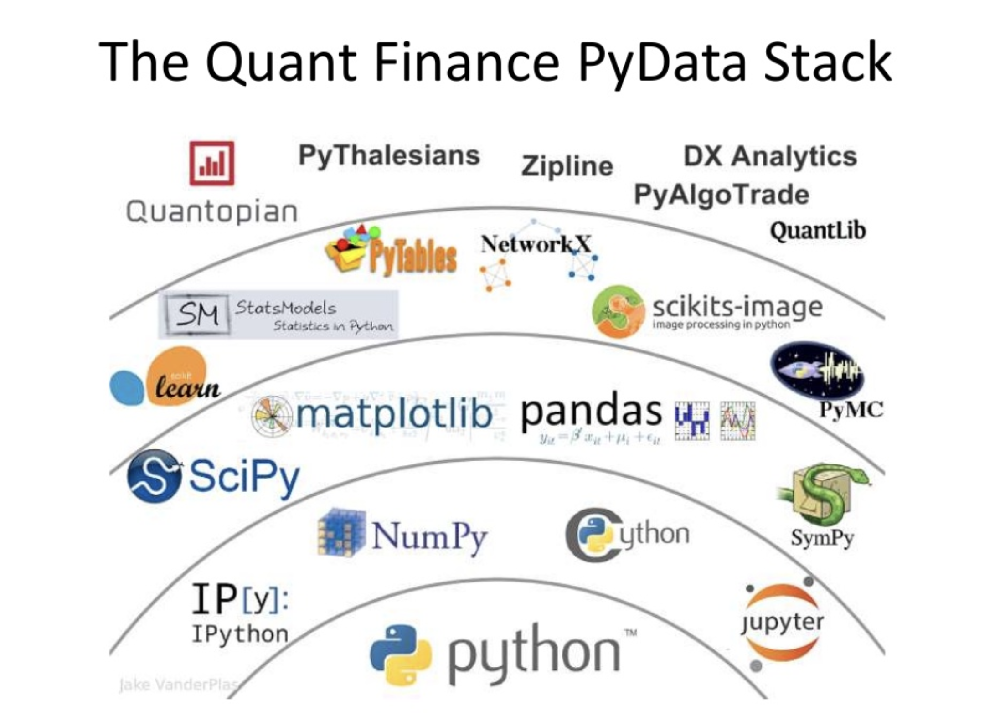

# Evaluating-Investments-using-PyFolio
A repository that helps evaluate an investment portfolio and provides risk analytics using an amazing open-source package developed by Quantopian, called PyFolio.

